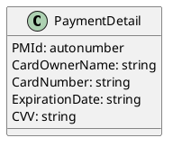

# PlantUML 使用範例指引

- 系統架構圖
- 類別圖

```
@startuml component
actor client
node app
database db

db -> app
app -> client
@enduml
```

@startuml component
actor client
node app
database db

db -> app
app -> client
@enduml





