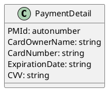

# PlantUML 使用指引

## PlantUML 應用範例

### 系統架構圖（Componment Diagram）


```
@startuml component
actor client
node app
database db

db -> app
app -> client
@enduml
```

### 循序圖（Sequence Diagram）


### 流程圖


### 類別圖（Class Diagram）




